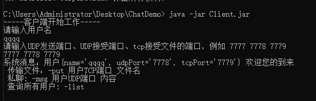

#### 1. 先启动服务器 java -jar Server.jar


注意：服务器端口为6666

#### 2. 再启动客户端 java -jar Client.jar

先输入用户名如: qqqq

再输入端口，以空格隔开，如：7777 7778 7779



命令：

```
-list   //查询所有用户，不显示自己
-put 用户TCP端口 文件名  // 传输文件
-msg 用户名UDP端口 内容   // 私聊

注意：
1. 指令时候端口不能输错了。
2. 绑定端口时候未作重复处理，输入的各用户端口需要不同。

例如
用户A为：7777 7778 7779
用户B为：8887 8888 8889
```
